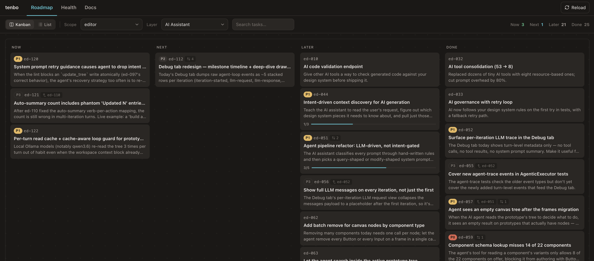
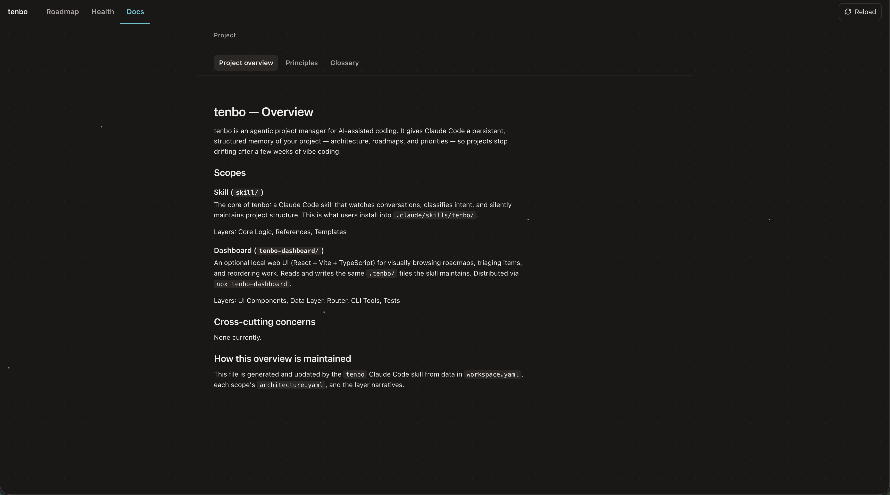
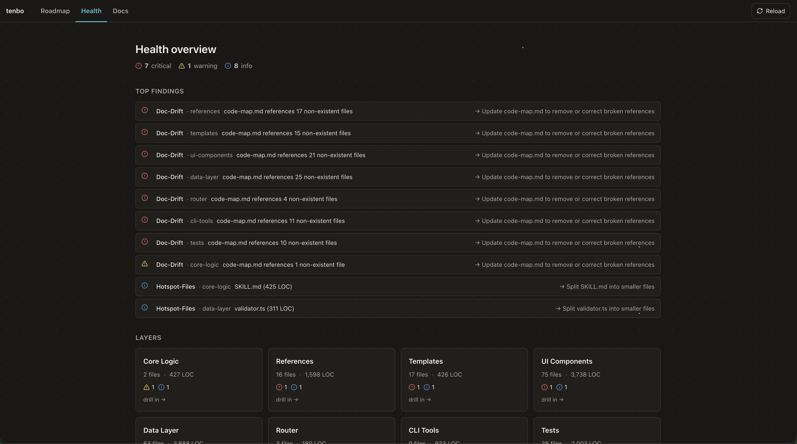

# tenbo

[](https://www.npmjs.com/package/tenbo-dashboard)

An agentic project manager for AI-assisted coding. tenbo gives your AI coding assistant a persistent project memory — it tracks architecture, roadmaps, and priorities so you can build fast without losing the plot.

## The problem

AI-assisted coding lets you ship features fast. But speed creates a new problem: **projects drift.**

- Architecture decisions are made in chat and forgotten by the next session
- Boundaries between components blur as the AI takes shortcuts to get things working
- Features get half-built, parked, and never revisited
- No one tracks what was built, why, or what's next
- The codebase grows but the shared understanding of it doesn't

After a few weeks of vibe coding, you have working software and zero navigability. Your AI can re-read the entire codebase to answer "what does this project do?" — but that costs thousands of tokens every session and still misses the decisions that shaped it.

## How tenbo helps

tenbo is a Claude Code skill that runs alongside your normal coding workflow. It watches what you build, maintains a structured map of your project, and keeps a living roadmap — all without you having to learn any commands or schemas.

- **Persistent memory across sessions.** Architecture decisions, roadmap items, and project context survive between conversations. Your AI assistant starts every session knowing where you left off.
- **Automatic structure maintenance.** As you code, tenbo silently updates architecture docs, dependency maps, and code maps. Drift is caught early, not after it's too late.
- **Living roadmap.** Ideas, tasks, and priorities tracked in plain YAML. Items flow from "later" to "now" to "done" with acceptance criteria and completion checks.
- **Health signals.** Stale items, orphaned layers, threshold violations, and architectural drift are surfaced proactively — not buried in tech debt.
- **Natural language interface.** Just talk: "what should I build next?", "this is getting messy", "finished the auth system". No commands to memorize.

## What's in this repo

- **`skill/`** — The Claude Code skill (SKILL.md + references + templates).
- **`cursor/`** — The Cursor rule package (multiple flat `.mdc` files, mirroring the skill). Same content, Cursor-native frontmatter.
- **`tenbo-dashboard/`** — An optional local web dashboard for visual roadmap browsing, item triage, and drag-reorder. Published to npm as `tenbo-dashboard`. Editor-agnostic — works for both Claude Code and Cursor users.

## Install

One line — detects which editor(s) you have installed (Claude Code, Cursor) and installs tenbo for each, plus the optional `tenbo-dashboard` companion. Safe to re-run as an updater.

```bash
curl -fsSL https://raw.githubusercontent.com/poyi/tenbo/main/install.sh | bash
```

Same `.tenbo/` data on disk works for both editors — a project set up in one is portable to the other.

> **What does it do?** Run `--dry-run` first if you want to see exactly what changes:
> ```bash
> curl -fsSL https://raw.githubusercontent.com/poyi/tenbo/main/install.sh | bash -s -- --dry-run
> ```
>
> Other useful flags:
> - `--list` — show the editor matrix and exit
> - `--only cursor` (or `--only claude`) — install for one editor only
> - `--minimal` — skip the npm dashboard install
> - `--help` — full reference
>
> For reproducible installs, pin a tag instead of `main`:
> ```bash
> curl -fsSL https://raw.githubusercontent.com/poyi/tenbo/v0.4.0/install.sh | bash
> ```

That's it. Open your editor in a project and ask: **"set up tenbo"**.

### Manual install (if you'd rather not curl-pipe a script)

The installer just runs `git clone` + `cp -r` under the hood. If you'd rather do it by hand:

```bash
# Clone once
git clone https://github.com/poyi/tenbo.git /tmp/tenbo

# Claude Code skill (only if you use Claude Code)
mkdir -p .claude/skills && cp -r /tmp/tenbo/skill/ .claude/skills/tenbo/

# Cursor rule (only if you use Cursor)
mkdir -p .cursor/rules && cp -r /tmp/tenbo/cursor/. .cursor/rules/

# Optional dashboard
npm install -g tenbo-dashboard@latest

rm -rf /tmp/tenbo
```

Open your editor and ask: **"set up tenbo"**.

> **Allowlist tip for Cursor:** to avoid permission prompts when tenbo runs CLI commands, add `npx tenbo-dashboard *` to Cursor's auto-run allowlist (Settings → Features → Agent → Auto-run).

#### If tenbo doesn't activate

Cursor's Agent Requested mode loads rules based on intent inferred from the message. It's mostly invisible, but a few patterns are worth knowing if the agent doesn't pick up tenbo when you'd expect:

| Reliability | What to type |
|---|---|
| **Most reliable** — phrases that mention "tenbo" by name | `"set up tenbo"`, `"refresh tenbo"`, `"update tenbo"`, `"tenbo, track this: <idea>"`, `"what does tenbo say I should build next?"`, `"populate tenbo for [layer]"` |
| **Mostly reliable** — natural-language phrases (Claude-Code-style) | `"what should I build next?"`, `"this code is getting messy"`, `"finished the auth system"`, `"can this scale to multiplayer?"` |
| **Always works** — explicit `@`-mention | `@tenbo` (forces the entry rule into context; from there the intent router takes over) |

If you find natural-language phrases consistently miss in your Cursor setup, mention "tenbo" explicitly or `@tenbo` once at the start — both prime the rule for the rest of the session.

### What happens next (both editors)

1. The agent detects the skill / rule and offers to set up tenbo ("Want me to map the project structure?")
2. tenbo creates a `.tenbo/` directory in your repo with architecture docs, roadmaps, and layer definitions
3. From then on, tenbo listens for planning signals, tracks work, and maintains docs as you code

## Getting started

The first prompt depends on whether you're starting fresh or layering tenbo onto something that already exists.

### Brand new codebase

You haven't written code yet — or you have a scaffold and not much more. tenbo works conversationally: it asks what you're building, proposes a structure, and seeds a starter roadmap so you have somewhere to begin.

```
"Set up tenbo. I want to build [a 2D farming sim / a habit tracker / a pricing API]."
```

What happens: tenbo asks a couple of questions about who it's for, proposes 3–5 product-shaped layers (e.g. "Inventory", "Day Cycle", "Save System" — not "controllers" and "models"), and writes a `.tenbo/` directory with empty layer skeletons and 3–5 starter roadmap items derived from your description. You leave the conversation with a plan, not just an empty repo.

```
"What should I build first?"
```

Best follow-up. Picks one of the seeded items, with a short rationale.

### Existing codebase

You already have a working project — possibly a messy one — and you want tenbo to map what's there before you do anything else.

```
"Set up tenbo."
```

What happens: tenbo scans your source tree, detects workspaces (monorepo or single app), proposes 5–10 product-shaped layers per scope, asks you to confirm or adjust, then writes the `.tenbo/` scaffolding. It also imports any existing `ROADMAP.md`, GitHub issues, and TODO/FIXME comments it finds, classifying them into the right layers. Setup ends with an inline health summary — file counts, doc-drift findings, hotspot signals — and offers to capture the most important ones as roadmap items.

```
"What should I work on first?"
```

If the health scan surfaced anything critical, this picks it up. Otherwise it points you at the highest-priority `next` item from imported issues.

```
"Document the [auth / billing / X] layer."
```

Use this when you want tenbo to populate a layer's `intent.md` and `code-map.md` in depth — responsibilities, boundaries, key files, extension recipes. Best for a layer you understand well so you can correct anything tenbo gets wrong.

### Example prompts (everyday use)

| Say this | What tenbo does |
|---|---|
| `"What should I build next?"` | Reads your current roadmap, weighs `now`/`next`/priority/blockers, and recommends 2–4 items with a short rationale — not a queue dump. |
| `"Add OAuth support later"` | Captures it as a `later` roadmap item under the right layer, with a one-line note. No follow-up questions unless the layer is ambiguous. |
| `"This code is getting messy"` | Runs a health pass — hotspots, doc drift, coupling — and proposes a prioritized cleanup plan. Picks the top 2–3 issues, not all of them. |
| `"Finished the auth system"` | Marks the matching item done, refreshes the layer's docs to match the code, runs validation, and stamps the completion. |
| `"Can this scale to multiplayer?"` | Reads architecture and principles, surfaces the layers and invariants that would break, and gives a yes/no with the specific risks. |
| `"What does this app do?"` | Plain-language summary built from the project overview and per-layer narratives — useful for new contributors or for jogging your own memory. |
| `"Refresh tenbo"` | Re-scans the tree, updates layer file globs, and recomputes health findings. Run this after a significant refactor. |
| `"Update tenbo"` | Checks GitHub + npm for newer skill or dashboard versions, semver-compares, and walks you through any updates. |
| `"Complete all next items"` | Dispatches a subagent per item in `next`, runs each through the completion bar, and reports a batch summary. Has guardrails on batch size and cost.|

## Install the dashboard (optional)

The dashboard is a local web UI that visualizes the same `.tenbo/` files Claude maintains. Skill and dashboard read and write the same data — edits in one show up in the other on next refresh.

```bash
# Run in your project directory (where .tenbo/ lives)
npx tenbo-dashboard
```

Opens at http://localhost:5174 (or the next available port).

### What the dashboard gives you

Three views, each solving a different problem AI-assisted projects accumulate over time.

#### Roadmap — "What should I work on next?"



A kanban board across `now` / `next` / `later` / `done`, grouped by scope and layer. Drag to reprioritize, click to edit, see at a glance what's in flight versus blocked. The roadmap is the same one Claude reads — when you say "what should I build next?", this is what's behind the answer. Useful when planning a week, triaging a backlog dump, or showing someone else what's happening on the project without scrolling git log.

#### Docs — "What does this project actually do?"



The project overview, principles, and glossary in one place — alongside per-layer narratives, intents (responsibilities + boundaries + invariants), and code maps (entry points + key files + extension recipes). This is the cure for the "I haven't touched this codebase in a month and I have no idea where anything lives" problem. New contributors (human or AI) can read the docs view to get oriented in minutes instead of grep-ing for an hour.

#### Health — "Where is this codebase quietly rotting?"



A surface for the things that would otherwise become tech debt nobody mentions: layers that have grown past healthy thresholds (hotspots), code-map references that no longer match real files (doc drift), unreferenced source files that may indicate orphaned code, coupling violations, dead code. Each finding carries a severity, the file it points at, and a suggested fix. Catches drift early — when it costs an afternoon to address — instead of after it costs a refactor sprint.

### Dashboard CLI tools

The same package ships a few commands the skill uses behind the scenes (and that you can run yourself):

```bash
npx tenbo-dashboard validate          # Schema + consistency checks
npx tenbo-dashboard init-check        # Strict completeness check after fresh init
npx tenbo-dashboard metrics --all     # Recompute scope metrics + health findings
npx tenbo-dashboard next-id <prefix>  # Allocate next roadmap item ID
npx tenbo-dashboard --version         # Print the installed version
```

## How it works

tenbo maintains a `.tenbo/` directory in your repo:

```
.tenbo/
├── workspace.yaml          # Scopes, prefixes, project metadata
├── overview.md             # Project vision and constraints
├── principles.md           # Architectural principles
├── glossary.md             # Project-specific terminology
├── agent-context.md        # Session briefing (auto-generated)
├── roadmap.yaml            # Cross-cutting roadmap items
└── scopes/
    └── <scope>/
        ├── architecture.yaml   # Layers, file globs, dependencies
        ├── roadmap.yaml        # Scope-specific roadmap items
        └── layers/
            └── <layer>/
                ├── README.md       # Plain-English narrative
                ├── intent.md       # Responsibilities, boundaries, invariants
                └── code-map.md     # Entry points, key files, dependencies
```

All files are plain YAML and Markdown — human-readable, version-controlled, and editable by hand.

## Updating

Updates are user-initiated. Just ask your AI assistant in any session:

```
"Update tenbo"
```

tenbo detects every install path that exists — the Claude Code skill (`.claude/skills/tenbo/`), the Cursor rule package (`.cursor/rules/tenbo*.mdc`), and the `tenbo-dashboard` npm package — and checks each against its remote. Updates happen in lockstep: if a newer skill or rule requires a newer dashboard than you have, tenbo refuses the editor-package update first and walks you through upgrading the dashboard, so the two never drift out of sync. Your project data in `.tenbo/` is never touched.

Other prompts that work:

```
"Is tenbo up to date?"
"Check for tenbo updates"
```

### Manual update

If you'd rather update by hand:

```bash
git clone --depth 1 https://github.com/poyi/tenbo.git /tmp/tenbo

# Claude Code skill (only if installed)
cp -r /tmp/tenbo/skill/ .claude/skills/tenbo/

# Cursor rule (only if installed)
cp -r /tmp/tenbo/cursor/. .cursor/rules/

rm -rf /tmp/tenbo

# Dashboard (only if installed)
npm install -g tenbo-dashboard@latest
```

## Requirements

- **Skill / rule package**: Any project. Works with any language — Rust, Python, Go, TypeScript, etc. Requires [Claude Code](https://claude.ai/code) or [Cursor](https://cursor.com).
- **Dashboard**: Node.js 18+.

## License

MIT. See [LICENSE](LICENSE).
